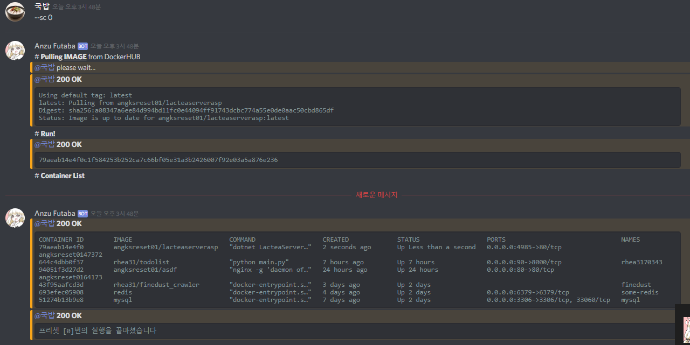

<div align="center">
<a href="https://github.com/des5141/AnzuFutaba">

</a>
</div>

> this is sample image that is use **Anzu Futaba**   

<div style="margin:100px;"> 
</div>

<div align="center">
<a href="https://github.com/des5141/AnzuFutaba">

</a>
</div>


# [Anzu Futaba](https://github.com/des5141/AnzuFutaba)

Use **Docker** _EASY_ then before!


## How to Install

1. create discord bot from [here](https://discordapp.com/developers/applications) and get bot-token

2. download and install node12 from [here](https://nodejs.org/en/)

3. download and unzip [Source](https://github.com/des5141/AnzuFutaba/archive/master.zip) folder

4. install modules  

   ```
   npm install discord.js
   npm install request
   npm install async
   ```

5. create token.txt on /  

   ```
   - Source/token.txt
   
   { "string" : "[YOUR DISCORD BOT TOKEN]" }
   ```

6. **run**  

   ```
   node main.js
   ```

   > forever start main.js (the service will never die)


## Feature

```js
`Standard Command Lists`
```

```js
`Docker Command List`
```
**1.** pull       `[IMAGENAME]`  
**2.** del        `[IMAGENAME]`  
**3.** run       `[IMAGENAME]  `  
**4.** stop     `[CONTAINERID]`  
**5.** start     `[CONTAINERID]  `  
**6.** restart `[CONTAINERID]`  
**7.** rm        `[CONTAINERID]  `  
**8.** prune  
**9.** ps  
**10.** list  
**11.** script `or` sc  

> ALSO CAN => `script set a:'''[code]'''`, `script list`, `scripts`, `script [NUMBER]`, `script rm [NUMBER]`, `script show [NUMBER]`


```js
`Additional Command List`
```

**1.** about  
`> interduce about Anzu Futaba`

**2.** clear  
`delete 99 messages`


## Version

* 2019 06/27 - **ADDED** Basic operators


## Support Git History

### Credits

Based on these amazing projects:

- Liberty🌠 by [Jeong Hyeon Kim](https://github.com/des5141)

## License

MIT