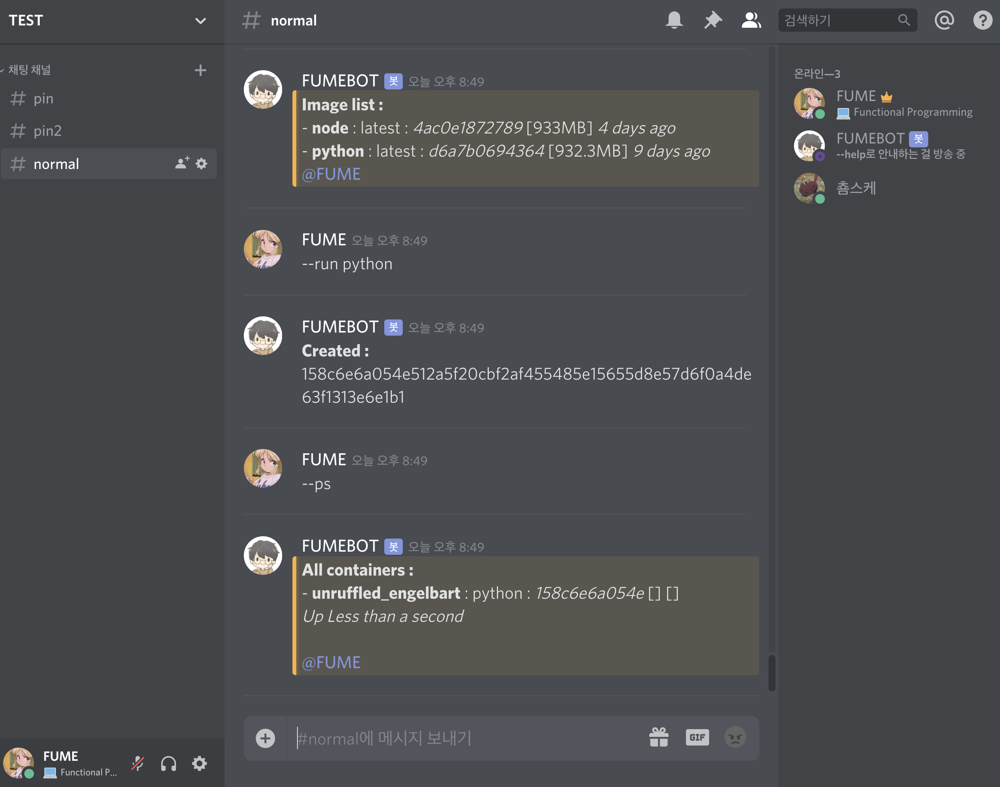

# [AnzuFutaba](https://github.com/liber31/AnzuFutaba)

**AnzuFutaba** is a tool that helps you make using a docker easier, more convenient, and faster, anytime, anywhere. All you have to do is install it on the server where the docker is installed.

* **Developer blog** : http://http://rhea31.gitbook.io/blog
* **License** : https://github.com/liber31/AnzuFutaba/blob/master/LICENSE

------



[](https://github.com/standard/semistandard)

[](https://github.com/standard/semistandard)

## How to Install

1. create discord bot from [here](https://discordapp.com/developers/applications) and get bot-token

2. download and install node12 from [here](https://nodejs.org/en/)

3. download and unzip [Source](https://github.com/des5141/AnzuFutaba/archive/master.zip)

4. install modules

   ```sh
   # on mac or linux
   ./install.sh
   
   # on windows
   ./install.bat
   ```

5. modify the **SETUP.ini**

   ```sh
   [discord]
   token = [YOUR BOT TOKEN]
   text = [YOUR BOT INSTRUCTION]
   type = [YOUR BOT TYPE]
   startLetter = [YOUR BOT COMMAND START LETTER]
   ```

6. **run**

   ```sh
   node program.js
   ```

## Feature

**Commands: ** 
  `img`, `image`, `images`   도커 이미지 목록을 보여줍니다  
  `rmi`   도커 이미지를 지웁니다  
  `pull`   도커 이미지를 받습니다  
  `prune`   불필요한 도커 이미지들을 지웁니다  
  `run`   컨테이너를 실행합니다  
  `ps`    컨테이너 목록을 보여줍니다  
  `stop`   컨테이너를 중지합니다  
  `restart`   컨테이너를 재시작합니다  
  `rm`   컨테이너를 지웁니다  
  `del`   이미지에 해당하는 모든 컨테이너를 지웁니다  
  `clean`   모든 컨테이너를 지웁니다  
  `script`, `sc`   스크립트를 만들거나, 보거나, 지우거나, 사용합니다  
  `scripts`, `scs`   스크립트 목록을 보여줍니다  
  `docker`   도커 명령어를 실행합니다  

**Options:**  
  `rmi`   [IMAGEID]  
  `pull`   [IMAGEID]  
  `run`   [IMAGEID] [CONTAINER NAME] <= [OPTIONS (docker run --help)]  
  `stop`   [CONTAINERID]  
  `restart`   [CONTAINERID]  
  `rm`   [CONTAINERID]  
  `del`   [IMAGEID]  
  `script`   [OPTIONS (list, set [NAME]: [CODES], rm [INDEX], show [INDEX])]  
  `docker`   <= [OPTIONS (docker --help)]   

## Branch

* master - new updated version

## Support Git History

### Credits

Based on these amazing projects:

- liber31 by [Jeong Hyeon Kim](https://github.com/liber31)

## License

MIT

---

Copyright 2019. by [liber31](https://github.com/liber31) all rights reserved.